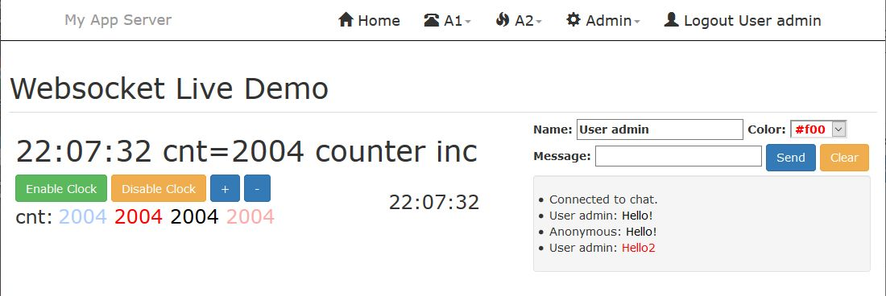

# Websocket Live Demo

An extension written in [Python](https://www.python.org/) for [my web application server](https://github.com/icoman/AppServer) tested on both **python2** and **python3**.

After seeing the [Phoenix.LiveView](https://hexdocs.pm/phoenix_live_view/Phoenix.LiveView.html) demos and understanding that it updates the web page in real time through the websocket, I imagined a solution with [Python](https://www.python.org/).

## Live Template Syntax

The [bottlepy](https://bottlepy.org/) template **index.tpl** (from folder **view**) is processed for tags << and >>.

* All references to << @variable >> are replaced with an html span tag with unique generated id

* All references to << ?variable >> are replaced with javascript call **wsGet('variable')**

* All references to << ?variable initial_value >> are replaced with javascript calls **wsInit('variable', initial_value)** followed by **wsGet('variable')**

* All references to << !server_function one_argument >> are replaced with javascript call **wsCall('server_function', one_argument)**

[The web server](https://github.com/icoman/AppServer) requires [GeventWebSocketServer](https://pypi.org/project/gevent-websocket/) (**pip install gevent-websocket**) and the extension bottle-websocket (**pip install bottle-websocket**).

Also the server need **config.ini** to be updated to use **webserver = mygeventws** .

Install: Just copy the folder of this project into **extensions** folder of [AppServer](https://github.com/icoman/AppServer).
